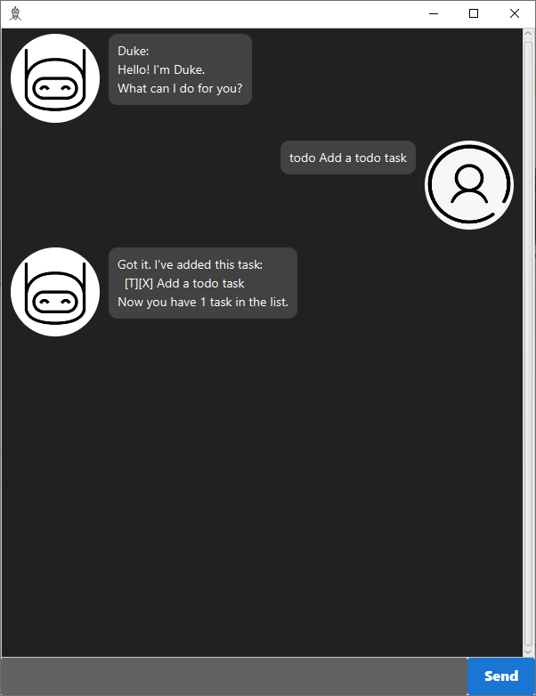
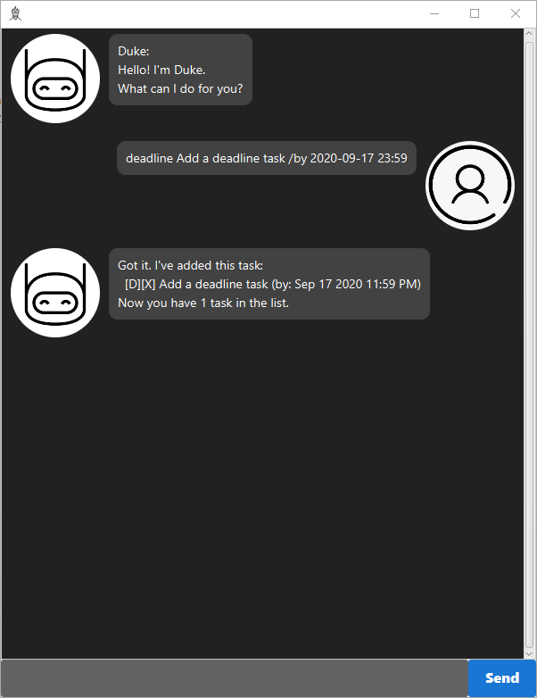
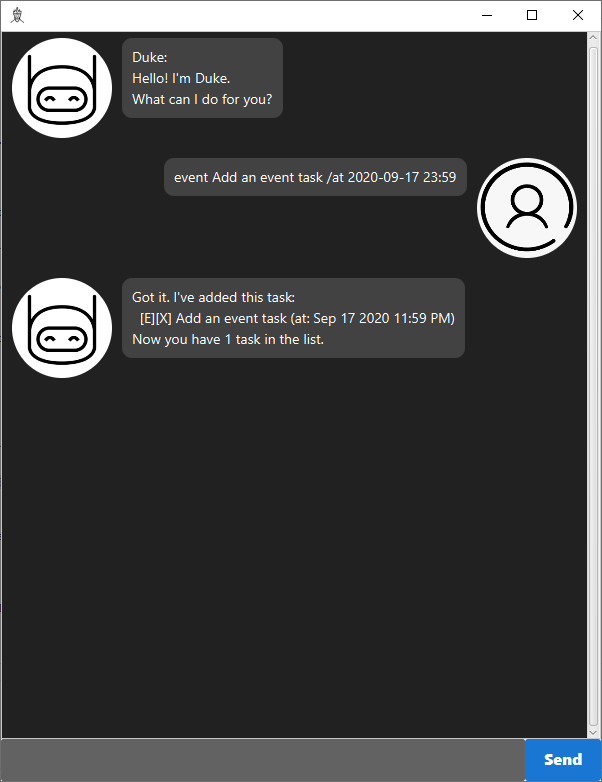
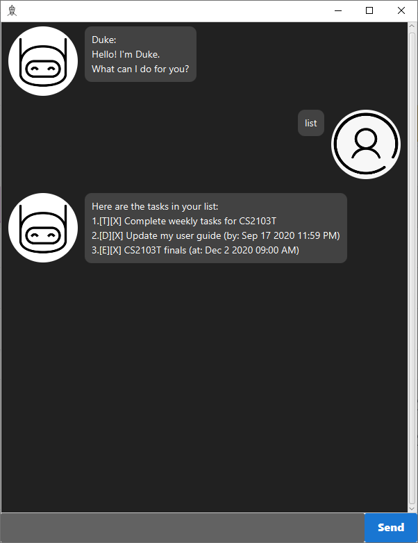
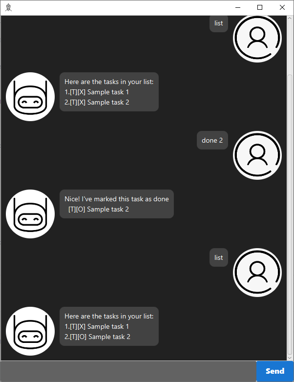
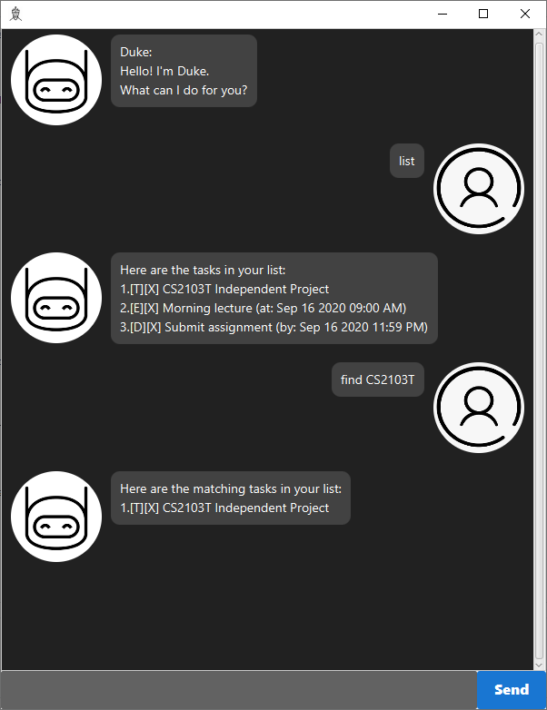
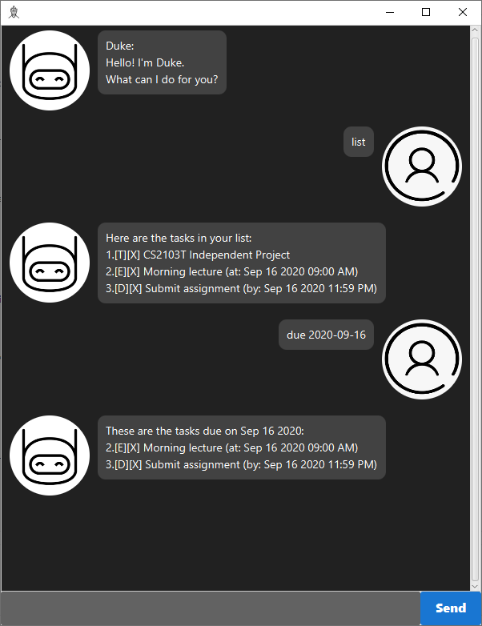
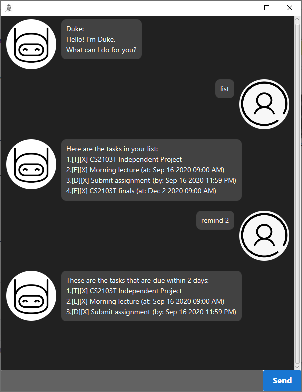
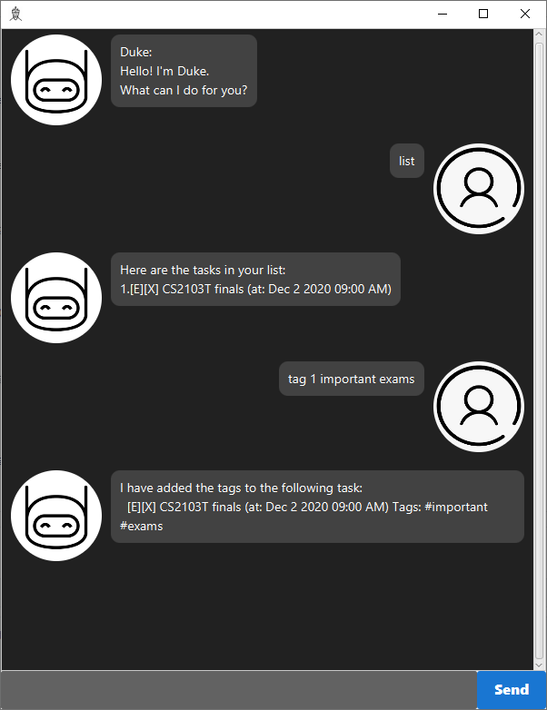
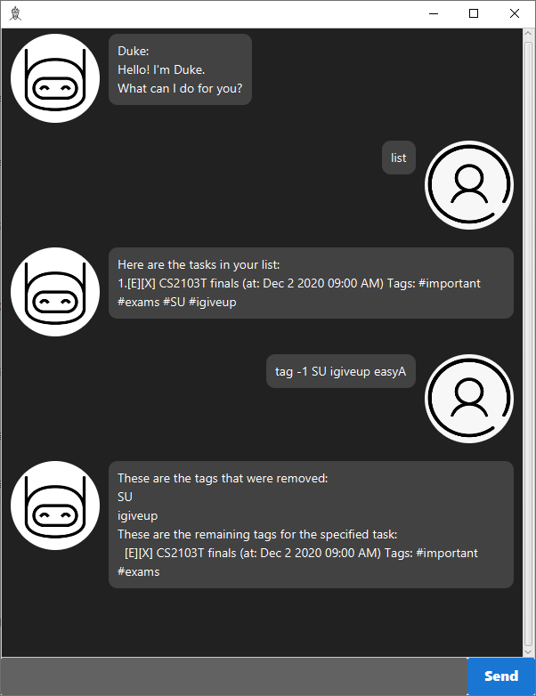

# Duke User Guide

Welcome to the repo for my Duke chatbot. The User Guide will guide you through on how to set-up and use the Duke chatbot.

# Table of Contents

+ [Getting Started](#getting-started)
+ [Features](#features)
   + [Adding A Task](#adding-a-task)
      + [Todo](#todo)
      + [Deadline](#deadline)
      + [Event](#event)
   + [Showing All Tasks](#showing-all-tasks)
   + [Completing A Task](#completing-a-task)
   + [Deleting A Task](#deleting-a-task)
   + [Filtering Tasks](#filtering-tasks)
      + [By Keywords](#by-keywords)
      + [By Due Date](#by-due-date)
      + [Within A Timeframe](#within-a-timeframe)
   + [Tags](#tags)
      + [Adding Tags To Tasks](#adding-tags-to-tasks)
      + [Removing Tags From Tasks](#removing-tags-from-tasks)
   + [Exiting The App](#exiting-the-app)
+ [Data Storage](#data-storage)
      
   
# Getting Started

1. Download the latest jar file in the [releases page](https://github.com/Wong-ZZ/ip/releases).
2. Place the jar file in your desired folder.
3. Double click on the jar file or run `java -jar duke.jar` in the same directory as the jar file to run the app.

# Features

## Adding a Task

There are 3 different types of tasks that are supported, namely: `Todo`, `Deadline` and `Event`.
The following subsections will guide you on how to properly add the three different types of tasks.

### Todo

Todo tasks only stores the description of the task and does not store any information on when the task should be completed.

Syntax: `todo <description>`

Example: `todo Add a todo task`

Sample Usage:



### Deadline

Deadline tasks stores the description of the task and the deadline of the task.

Syntax: `deadline <description> /by <YYYY-MM-DD> <HH:mm>`

Example: `deadline Add a deadline task /by 2020-09-17 23:59`

Sample Usage:



### Event

Event tasks stores the description of the task and the time the event starts at.

Syntax: `event <description> /at <YYYY-MM-DD> <HH:mm>`

Example: `event Add an event task /at 2020-09-17 23:59`

Sample Usage:



## Showing All Tasks

Displays all the tasks that have previously been added.

Syntax: `list`

Sample Usage:



## Completing A Task

Mark a previously added task as done.

Syntax: `done <index of task>`

Example: `done 2`

Sample Usage:



## Filtering Tasks

The app provides several methods to filter the tasks.

### By Keywords

Filter tasks by keywords in the task's description.

Syntax: `find <keyword>`

Example `find CS2103T`

Sample Usage:



### By Due Date

Filter tasks by their due dates. Todo tasks are excluded since they do not contain any date time information.

Syntax: `due <YYYY-MM-DD>`

Example `due 2020-09-16`

Sample Usage:



### Within A Timeframe

Filter tasks that are due within X days from now. Todo tasks are included by default.

Syntax: `remind <number of days>`

Example `remind 5`

Sample Usage:



## Tags

Every task can be tagged in order to store additional information about the task. Unwanted tags can also be removed from the tasks

### Adding Tags To Tasks

Synxtax: `tag <index of task> <tag1> <tag2> ....`

Example: `tag 1 important exams`

Sample Usage:



### Removing Tags From Tasks

Synxtax: `tag -<index of task> <tag1> <tag2> ....`

Example: `tag -1 SU igiveup`

Note: If the task does not contain the tag to be deleted, the command would just ignore that specific tag.

Sample Usage:



## Exiting The App

Exit the app through a command.

Syntax: `bye`

# Data Storage

The tasks that have been added will be saved in a .txt file. It can be found in `./data/duke.txt` from the folder where the .jar file is at. Each task is saved as a line similar to the [command to add them](#adding-a-task) with some additional information prepended and appended to it. 

A `0` or `1` is prepended to the command to signify if the tasks is incomplete/complete respectively.

If the task has tags, ` //tags <tag1> <tag2>` will be appened to the command.

Examples: 
```
0event CS2103T finals /at 2020-12-02 09:00 //tags #important #exams
1todo Update readme
0deadline Submit assignment /by 2020-09-16 23:59 //tags #graded
```


